# LiveChat
Moderne webbasierte Echtzeit-Chat-Applikation basierend auf HTML, CSS und JavaScript.

---

## Projektbeschreibung

LiveChat ist eine Echtzeit-Messaging-Applikation, die im Rahmen der Projektarbeit **LB3** an der **GIBB Bern** entwickelt wurde. Die Anwendung ermöglicht registrierten Benutzern, in Echtzeit miteinander zu kommunizieren. Die Authentifizierung erfolgt über JWT, die Nachrichtenübertragung über WebSockets.

---

## Team

- **Venu** – Frontend-Entwicklung  
- **Mathu** – Frontend-Entwicklung  

---

## Funktionen

- Benutzerregistrierung und Login
- JWT-basierte Authentifizierung
- Echtzeit-Chat mit WebSocket
- Benutzerliste mit Online-Status
- Markdown-Unterstützung im Chat
- Profilbearbeitung
- Responsives Design (Desktop & Mobile)
- Dunkles Farbschema

---

## Technologien

### Frontend
- HTML5 – Struktur und semantischer Aufbau
- CSS3 – Layout, Dark Theme, Responsive Design
- JavaScript (ES6+) – Applikationslogik

### Backend & Kommunikation
- REST API – Benutzerverwaltung & Authentifizierung  
  https://chat.ndum.ch/api/v1
- WebSocket – Echtzeit-Kommunikation  
  wss://chat.ndum.ch

### Sicherheit
- JWT (JSON Web Token) – Authentifizierung
- HTTPS / WSS – Verschlüsselte Kommunikation
- LocalStorage – Session-Verwaltung

---

## Projekt Struktur
```
livechat-projektarbeit/
├── index.html             # Haupt-HTML-Datei
├── css/
│   ├── style.css          # Globale Styles und Variablen
│   ├── login.css          # Styles für Login- und Registrierungsseite
│   └── chat.css           # Styles für die Chat-Oberfläche
├── js/
│   ├── main.js            # Einstiegspunkt der Anwendung
│   ├── auth.js            # Authentifizierungslogik (Login / Registrierung)
│   ├── api.js             # Schnittstelle zur REST API
│   ├── chat.js            # Verwaltung der Chat-Funktionen
│   ├── websocket.js       # WebSocket-Verbindung und Echtzeit-Kommunikation
│   └── utils.js           # Hilfsfunktionen (Formatierung, Validierung, etc.)
├── config/
│   └── api.config.js      # Konfiguration der API-Endpunkte
├── assets/
│   ├── icons/             # Icons für die Benutzeroberfläche
│   └── images/            # Hintergrundbilder und UI-Bilder
└── docs/                  # Dokumentation/ Anleitung
```
## Installation

### Voraussetzungen

- Webbrowser (Chrome, Firefox, Edge oder Safari)
- Internetverbindung
- Optional: Node.js (für lokalen Webserver)

### Installation (lokal)

1. Repository klonen:
```bash
git clone https://github.com/venu21-dev/lb3-livechat-projektarbeit.git
cd lb3-livechat-projektarbeit
````

2. Anwendung starten:

**Direkt im Browser**

* Variante A: Direkt im Browser (Standard)

Die Datei * `index.html` im Browser öffnen.

* Variante B Lokaler Server (optional)

```bash
python3 -m http.server 8080
````

Anschliessend im Browser öffnen:
http://localhost:8080

---

# Dokumentation
Zusätzlich zum README gibt es auch eine separate Benutzeranleitung mit Schritt-für-Schritt-Erklärungen zur Nutzung der Anwendung:

**Benutzeranleitung:** [`docs/web_lb3_livechat_anleitung.pdf`]

Die Benutzeranleitung enthält:
- Registrierung und Anmeldung
- Nutzung des Chats
- Profil bearbeiten
- Abmelden
- Hinweise zur Passwortwahl und Funktionen

## Nutzung

### Registrierung

1. Anwendung öffnen
2. Auf Jetzt registrieren klicken
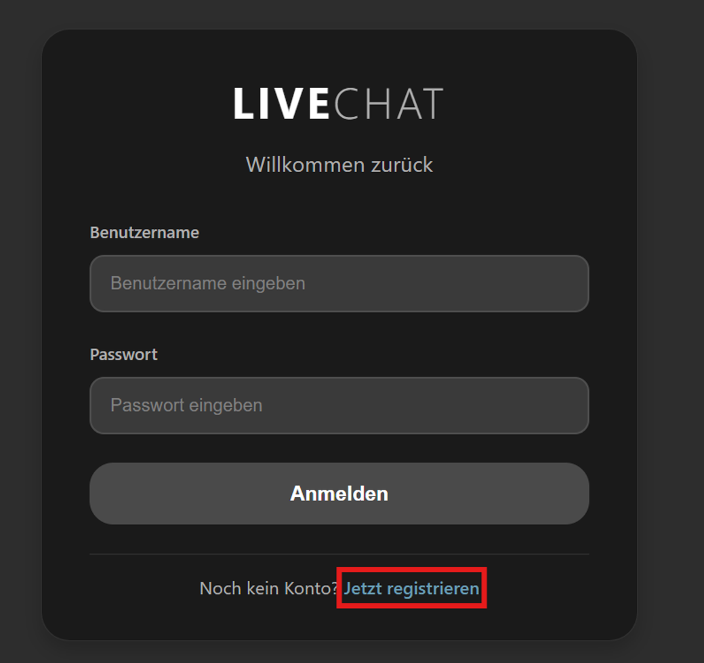
4. Benutzername und Passwort eingeben
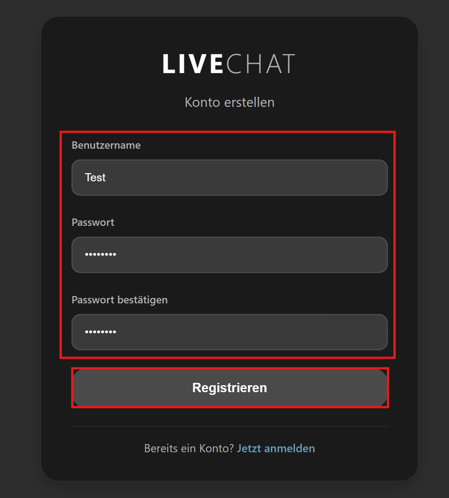
6. Auf Registrieren klicken

### Anmeldung (Login)

1. Benutzername und Passwort eingeben
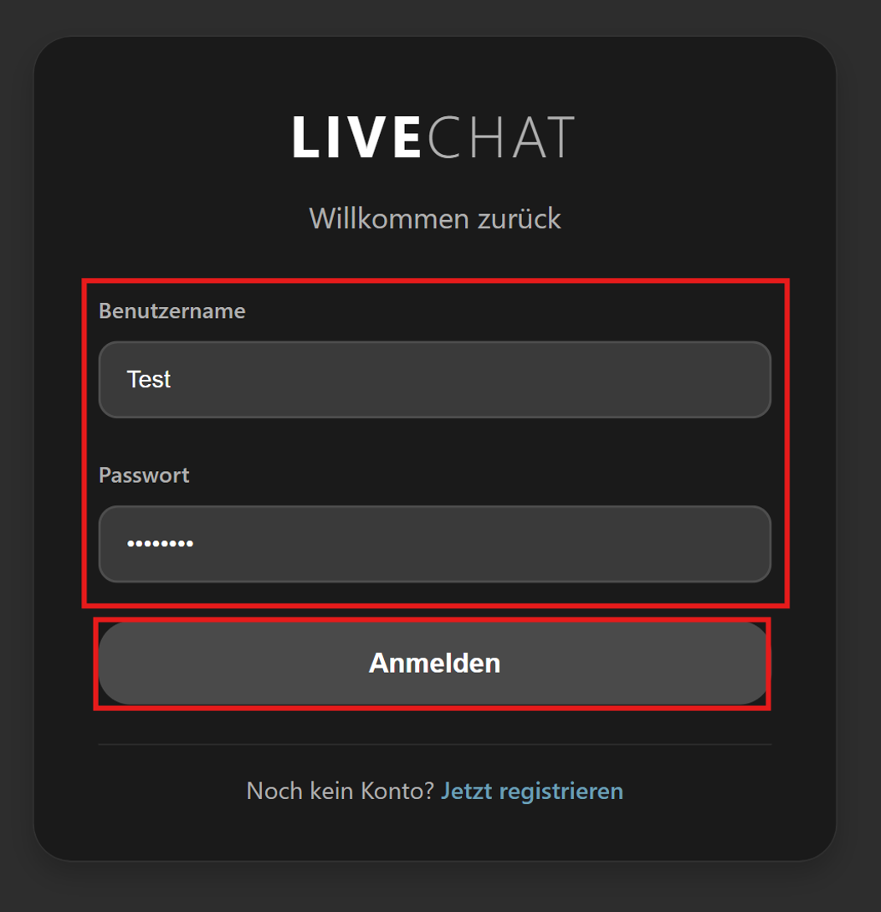
3. Auf Anmelden klicken, weiterleitung zur Chat-Ansicht

### Chat verwenden
1. Benutzer aus der Liste auswählen
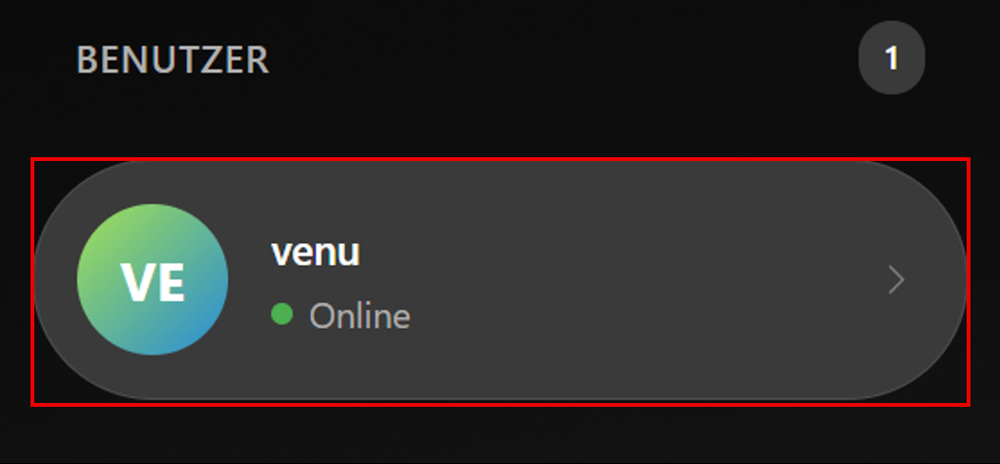
3. Nachricht eingeben
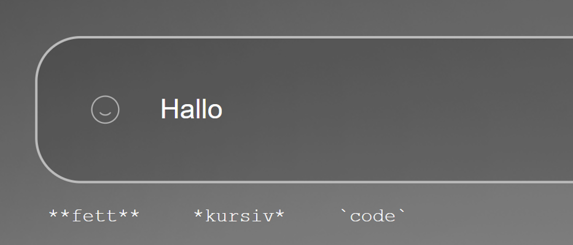
4. Mit Senden abschicken
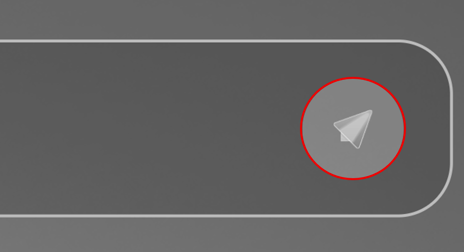
Hinweise:

* Nachrichten werden in Echtzeit übertragen
* Markdown wird unterstützt (**fett**, *kursiv*, `code`)

### Profil bearbeiten

1. Auf Profil-Symbol klicken
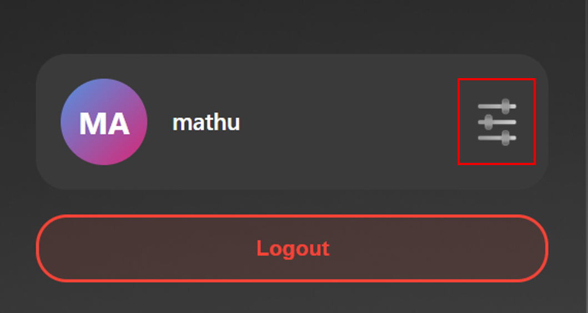
3. Benutzername oder Passwort ändern
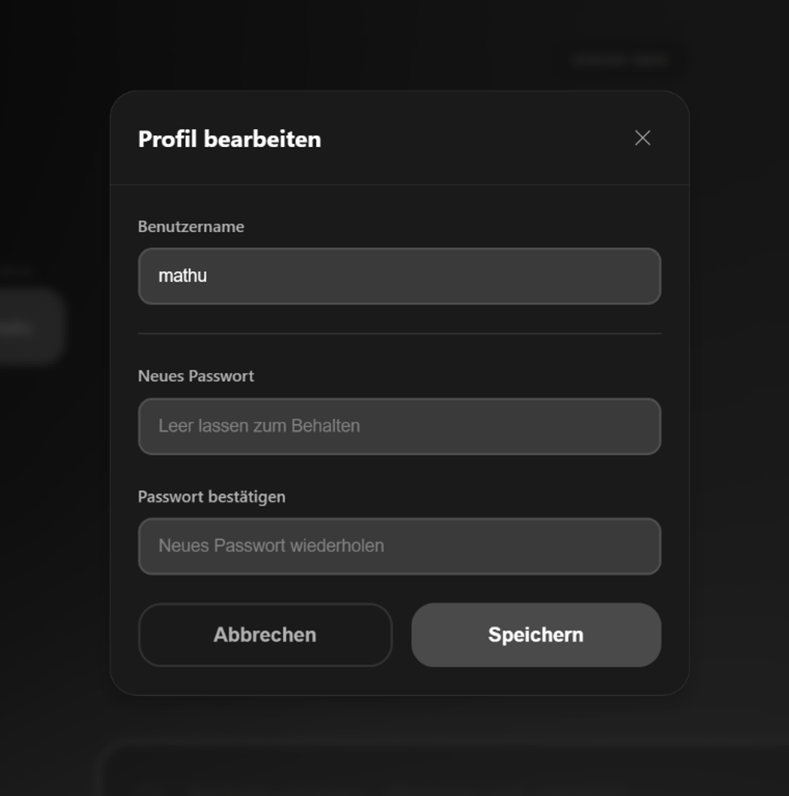
5. Speichern oder abbrechen

### Logout

1. Auf Logout klicken
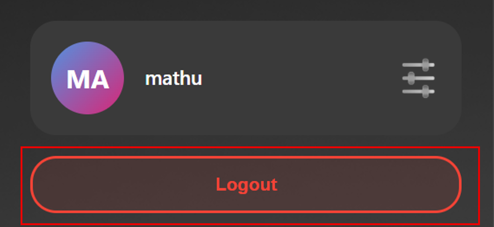
3. Sitzung wird beendet, weiterleitung zur Login-Seite

---

## Architekturbeschreibung

### 1. Architekturübersicht

LiveChat basiert auf einer Client–Server-Architektur.
Das Frontend läuft im Browser und kommuniziert über REST und WebSocket mit einem externen Backend.

### 2. Systemarchitektur (Visualisierung)

Gesamtübersicht
```
┌──────────────┐
│   Benutzer   │
└──────┬───────┘
       │
       ▼
┌──────────────────────────┐
│ Frontend (Browser)       │
│ HTML / CSS / JavaScript  │
└─────────┬────────────────┘
          │
          ├──────── REST (HTTPS) ────────┐
          │                               │
          ▼                               ▼
┌───────────────────┐           ┌───────────────────┐
│ Backend REST API  │           │ WebSocket Server  │
│ - Login           │           │ - Realtime Chat   │
│ - Registrierung   │           │ - Online-Status   │
│ - Benutzer        │           └───────────────────┘
└───────────────────┘ 
```

### 3. Komponenten

#### Frontend (Client)

* UI-Darstellung
* Eingabeverarbeitung
* REST- & WebSocket-Kommunikation
* JWT-Verwaltung

#### Backend API (extern)

* Benutzerregistrierung
* Login
* JWT-Erstellung
* Benutzerverwaltung

#### WebSocket Server

* Nachrichten-Broadcast
* Online-Status
* Realtime-Übertragung

---

## Datenfluss

### Login-Ablauf

Benutzer → Login-Formular → REST API → JWT → LocalStorage → Chat

### Chat-Ablauf

Benutzer → WebSocket → Server → Alle Clients

---

## Mockup-Entwurf


### Webansicht und Mobilansicht | Figma Mockup

Webansicht

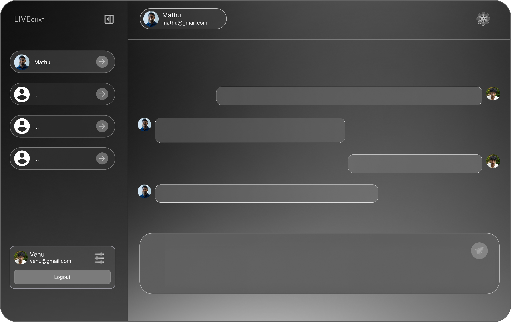

Mobilansicht

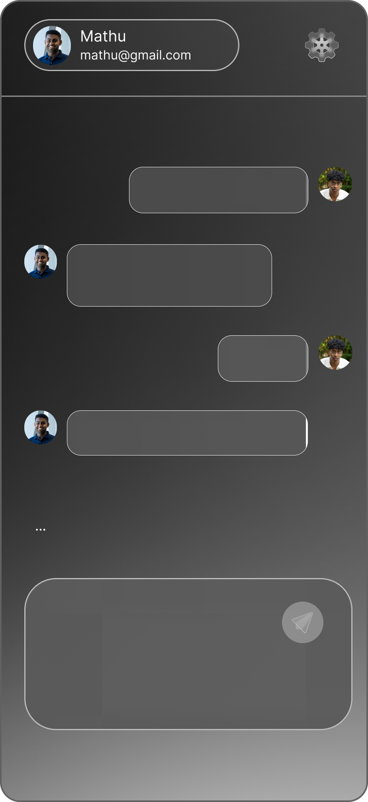


### Login-Seite

* Benutzername
* Passwort
* Anmelden-Button
* Link zur Registrierung

### Registrierungs-Seite

* Benutzername
* Passwort
* Passwort bestätigen
* Validierung (mind. 8 Zeichen)

### Profil bearbeiten

* Benutzername ändern
* Passwort ändern
* Speichern / Abbrechen

### Logout

* Klick auf „Logout“
* JWT wird gelöscht
* Weiterleitung

### UI-/UX-Grundsätze
- Dark Theme
- Responsive Design
- Klare Struktur
- Konsistente Farben
- Grosse, gut klickbare Elemente
- Einfache Navigation

---

## Allgemeine Angaben

* **Kurs:** Web Development/ Engineering
* **Dozent:** Nicolas Dumermuth
* **Projekt:** LB3 – Praktisch | LiveChat
* **Abgabe:** 18. Januar 2026

---

**Erstellt von Venu & Mathu**
